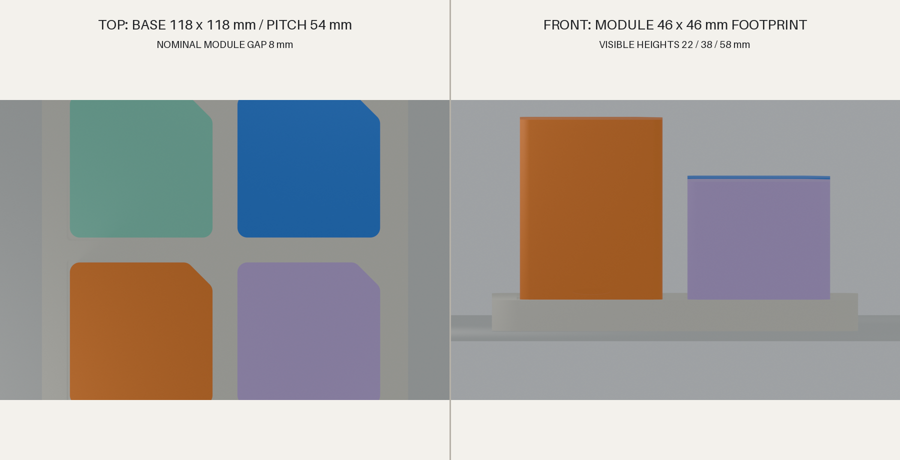

# Dimension Sheet

All dimensions are **V0 experimental, unvalidated** and expressed in millimeters.

## Base

| Parameter | Value |
| --- | ---: |
| Overall width × length × thickness | 118 × 118 × 10 |
| Socket rows × columns | 2 × 2 |
| Socket pitch | 54 |
| Socket opening | 41 × 41 |
| Socket depth | 5.2 |
| Socket facet | 7 |
| Outer corner radius | 8 |

## Common module family

| Parameter | Value |
| --- | ---: |
| Visible footprint | 46 × 46 |
| Low visible height | 22 |
| Medium visible height | 38 |
| Tall visible height | 58 |
| Facet size | 8 |
| Nominal adjacent finger gap | 8 |
| Guide insertion depth | 4.8 |
| Terminal bottom clearance | 0.4 |
| Minimum declared wall | 1.6 |

Exported STL total heights include the 4.8mm hidden guide: 26.8, 42.8, and 62.8mm.

## Fit variants

| Fit | Guide side clearance, each side | Pocket effective depth | Nominal final CAD interference |
| --- | ---: | ---: | ---: |
| Light | 0.50 | 0.46 | 0 mm³ |
| Standard | 0.40 | 0.30 | 0.217 mm³ |
| Firm | 0.30 | 0.14 | 1.103 mm³ |

The tiny interference values only indicate where PLA must elastically accommodate the shallow seating beads. They do not predict insertion force or durability.

