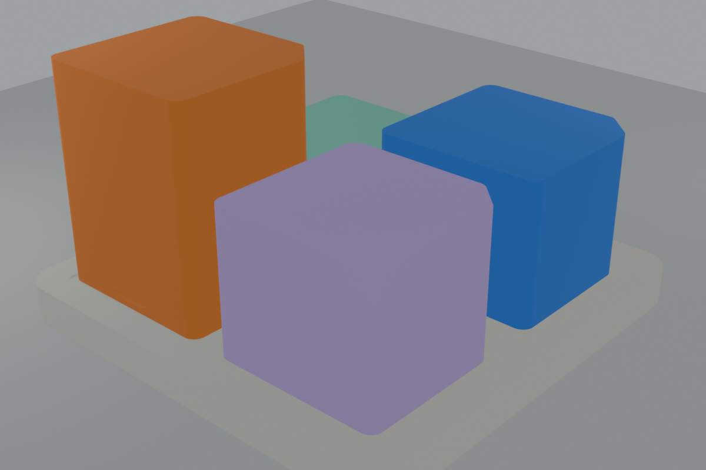
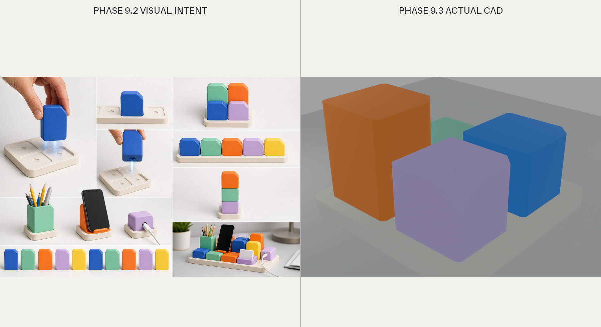

# Visual Review

Review basis: Blender renders imported from the generated STL files. No image-generation model was used for CAD validation.

| Hard gate | Result | Evidence |
| --- | --- | --- |
| Reads as a color block family | Pass | Common faceted footprint and repeated color bodies in assembled view. |
| Base is not merely a perforated engineering coupon | Pass | Rounded 118mm neutral plate with repeated shallow faceted fields. |
| Modules do not read as exposed plugs | Pass | Guide is hidden when seated; visible body remains a complete block. |
| Low/Medium/Tall share one family | Pass | Identical footprint, facet, corner treatment, and lower grip cue. |
| Interface is quiet when seated | Pass | Only a small perimeter reveal remains visible. |
| Adjacent blocks retain finger access | Pass for CAD geometry | Nominal visible gap is 8mm; hand comfort remains unvalidated. |
| Phase 9.2 B collection character remains | Pass | Upright faceted silhouettes, mixed heights, neutral Base, color modules. |
| Avoids LEGO copy/compatibility | Pass | No studs, tube grid, brick ratio, logo, or compatible dimensions. |

## Honest limitations

The test blocks are intentionally neutral solids, not finished Tray/Cup/Cable/Phone products. Their visual review validates proportion and family language only. Tactile quality, color accuracy, layer texture, grip comfort, and installed wobble require the real print.

