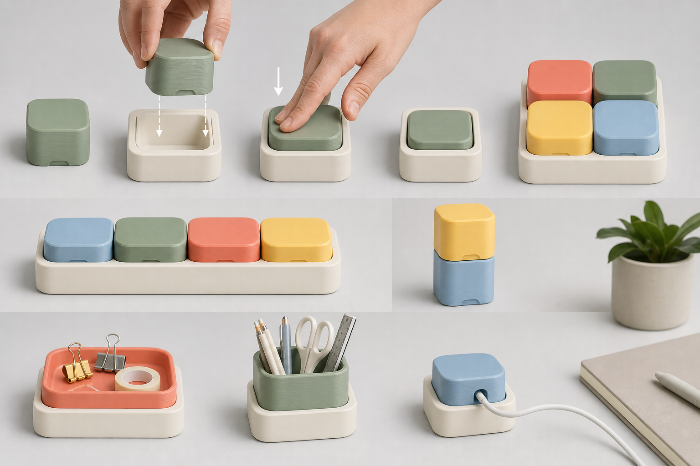

# Direction A: Soft Cell Blocks

## Visual idea

Low, chunky rounded-square blocks sit inside softly radiused ivory cells. The family is calm and furniture-friendly: color is concentrated in the removable block while the base creates a consistent spatial rhythm.

## Push-In / Pull-Out experience

The user grips the shallow block around its exposed perimeter, aligns its broad underside with the open cell, and presses straight down. A small front finger relief signals where to grip for a direct upward pull. No lateral or rotational step is part of the intended action.

## Expansion grammar

- Single cell for a focused task
- Long strips for desk edges
- 2x2 bases for compact work zones
- Direct block-on-block visual stacking for hierarchy, subject to later stability testing

## Module family shown

- Shallow tray
- Pencil cup
- Cable block

## Strengths

- Most immediate “pick and press” reading
- Broadest calm interior compatibility
- Strong color-collection rhythm
- Functional modules remain visually subordinate to the common block body

## Risks to validate later

- A broad cell could feel like a storage bin rather than a precision connection.
- Low blocks may need a deliberate grip feature for reliable removal.
- Vertical stacking is visually understandable but not yet mechanically proven.
- Large modules could consume desk area quickly.

