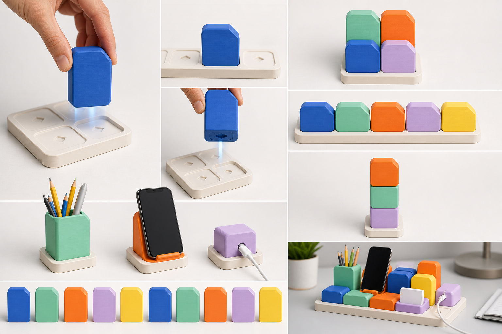

# Direction B: Facet Totem Blocks

## Visual idea

Taller blocks use one softly clipped corner as a proprietary family cue. The asymmetry communicates orientation without arrows and creates a more graphic, collectible silhouette than Direction A.

## Push-In / Pull-Out experience

The block is grasped by its tall side faces and pressed vertically into a shallow cell. The clipped corner helps the hand and eye resolve orientation before contact. Removal is a straight pull using the exposed body; there is no rail, hook, or turning action.

## Expansion grammar

- Repeated horizontal rows
- Mixed-height 2x2 collections
- Totem-like vertical groupings
- A shared base field that allows tall and short blocks to coexist

## Module family shown

- Pencil cup
- Phone rest
- Cable block

## Strengths

- Strongest individual block identity at a distance
- Orientation cue is integrated into the silhouette
- Vivid colors read as an intentional collection
- Tall body provides a generous hand grip

## Risks to validate later

- The stronger toy-like character may be too loud for some interiors.
- Tall blocks can visually and physically obstruct neighboring modules.
- Vertical arrangements require a credible stability strategy.
- The clipped-corner cue must remain consistent across very different functions.

