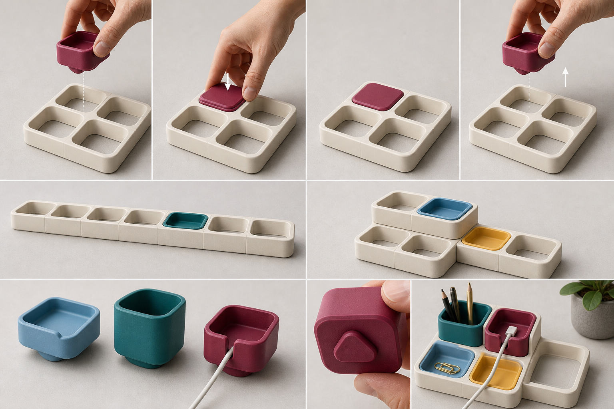

# Direction C: Frame & Core Blocks

## Visual idea

An ivory structural frame remains visible around a colorful functional core. The frame is not a thin docking plate; it is a repeated block itself, creating an architectural lattice that can cross horizontal and vertical arrangements.

## Push-In / Pull-Out experience

The colored core is held around its upper perimeter and pressed straight into an open frame. It is pulled straight back out from the same exposed edge. The receiving geometry is visually contained inside the frame; no sliding or rotation is intended.

## Expansion grammar

- Open frames connect into rows and fields
- Frames step upward to create layered work zones
- Cores can move between equivalent frame cells
- Empty frames remain legible as available capacity

## Module family shown

- Small tray
- Pencil cup
- Cable block

## Strengths

- Clearest distinction between long-lived platform and replaceable function
- Empty capacity is visible and can invite another module purchase
- Ivory structure unifies more adventurous core colors
- Strong architectural character for multi-zone expansion

## Risks to validate later

- It may read as an organizer grid rather than an independent block collection.
- The frame uses more visual and physical space around each function.
- The removable core may feel less substantial when held alone.
- The structural frame could dominate the color collection.

